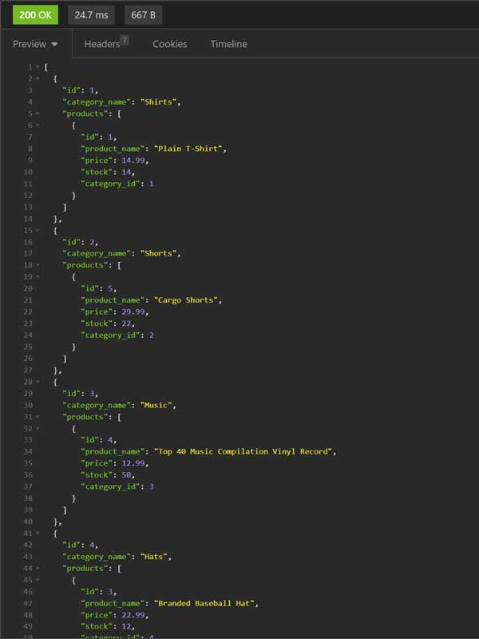

# fantastic-umbrella

## Description
[Repo](https://github.com/escowin/fantastic-umbrella)


e-commerce backend ORM exercise in where I established the model columns & relationships. I then employed ORM techniques to carry out CRUD operations on the database, and created a REST API to expose these operations.

## Table of Contents
- [Installation](#installation)
- [Code](#code)
- [Test](#test)
- [Screenshots](#screenshots)

- [Author](#author)

## Installation
Run the following command to install necessary dependencies:
```
$ npm i; npm start;
```

## Test
Run the following command to run tests:
```

```

## Code
- Languages: Javascript, SQL
- Frameworks: Node, Express
- Libraries: Sequelize, mysql2, dotenv
- Database: mySQL

## Screenshots


## Author
### Edwin M. Escobar
- [Email](mailto:edwin@escowinart.com)
- [GitHub](https://github.com/escowin)
